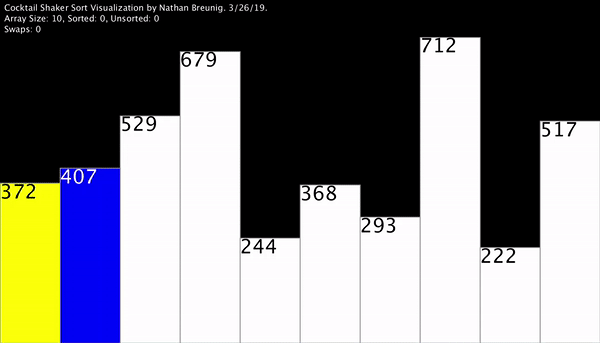
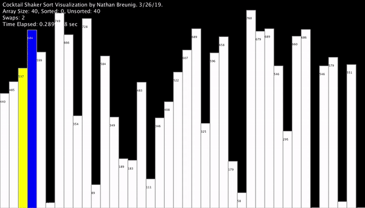

# Shaker Sort

🔙 [to the README](README.md)


A _variation_ of the bubble sort algorithm is the **cocktail shaker sort**. It works like this:

- On odd-numbered passes (1st, 3rd, 5th, etc...), _large_ values are carried to the top of the list (right).
- On even-numbered passes (2nd, 4th, etc...), _small_ values are carried to the bottom of the list (left).
- If no swaps occured in a pass, the data is sorted!

### Visualizations:



[Source](https://github.com/NBreunig3/)

# Coding Task:  

Write the function `shaker_sort(unsortedArray, debug)` to implement the [cocktail shaker sort](https://www.geeksforgeeks.org/cocktail-sort/)  algorithm ([visualization](https://www.youtube.com/watch?v=njClLBoEbfI)). It should return an array of values sorted into ascending order.

Your code goes in [script.js](script.js) and you should start on line 30.

The `debug` flag, if `true`, will cause your function to keep track of the _number of passes_ **and** the _number of swaps_. A _pass_ is once the function completes _either_ a right or a left direction. A _swap_ is whenever two values in the array _change places_. Once complete, the function will _return_ the sorted array and print to the console the number of passes and the number of swaps. For a thorough example, read the `bubble_sort()` code and run some tests using the `test_bubble()` function.

**Example:** Theoretical output for `shaker_sort(arrayOfInts(5, 1, 10), true)`
```
Given array: [5, 1, 4, 2, 8, 0, 2]
Sorted array: [0, 1, 2, 2, 4, 5, 8]
Passes: 5
Swaps: 12
```

**Note** - you can also test by passing a hard-coded array: 
```JS
shaker_sort([6, 5, 3, 1, 8, 7, 2, 4])
```

After coding the algorithm, don't forget to submit the code in both Github _and_ the Google Doc. Then complete [the discussion questions](https://classroom.google.com).

<br>

🔙 [to the README](README.md)

🐿️
